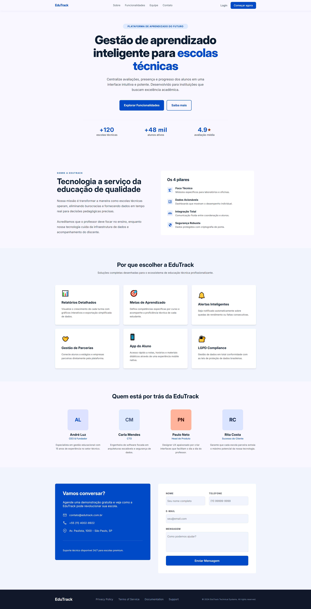

# 🎓 EduTrack — Plataforma de Gestão Escolar (React & TypeScript)


---

## 📝 Descrição
A **EduTrack** é uma landing page moderna para instituições de ensino técnico. O design original foi concebido através da IA **Stitch (Google)** e desenvolvido durante as aulas do curso Técnico em Desenvolvimento de Sistemas, onde transformamos o protótipo em componentes React funcionais.

Este projeto demonstra a capacidade de traduzir designs gerados por inteligência artificial em código limpo, tipado e profissional.

### 🖼️ Preview do Layout


O app contém:
- **Hero Section:** Interface baseada no design do Stitch com métricas de impacto.
- **Seção Sobre:** Detalhamento dos 4 pilares da plataforma utilizando ícones personalizados.
- **Funcionalidades:** Grid interativo apresentando os diferenciais técnicos do sistema.
- **Equipe:** Listagem dinâmica de membros com lógica de avatares automáticos.
- **Contato:** Formulário completo utilizando componentes customizados de UI.

---

## ✨ Principais Recursos
- **Design Driven by AI:** Implementação fiel do layout gerado pelo Stitch.
- **Componentização Avançada:** Desenvolvimento orientado a componentes junto ao instrutor.
- **Arquitetura de Dados:** Gerenciamento de conteúdo via arquivos `.tsx` na pasta `/data`.
- **Lógica de Strings:** Utilitário `stringUtils.ts` para geração de iniciais de nomes.
- **Histórico Organizado:** Uso de commits semânticos para documentar cada etapa da aula.

---

## 💻 Pré-requisitos
- **Node.js** (v18+)
- **NPM** ou **Yarn**

---

## 📥 Como Obter o Projeto

### Opção 1 — Git
```bash
- `git clone https://github.com/euAlexiaCalo/react-landing-page.git`
- `cd react-landing-page`
```

### Opção 2 — Download
- Baixe o arquivo **.zip** do repositório
- Extraia em uma pasta local
- Abra a pasta no VS Code

---

## 🚀 Executando o App
1. Instale as dependências:
   ```bash
   npm install
   ```
2. Inicie o servidor de desenvolvimento:
   ```bash
   npm run dev
   ```
3. Abra a URL exibida no terminal (ex: http://localhost:5173).

---

## 📂 Estrutura do Projeto

```text
/src
├─ assets/         # Ícones (incluindo iconsSobre) e imagens do projeto
├─ components/     # Seções da landing page (Hero, Sobre, Equipe, Contato, Footer)
├─ data/           # Arquivos de dados (funcionalidades.tsx, pilares.tsx, equipe.tsx)
├─ utils/          # Funções utilitárias (stringUtils.ts para iniciais de nomes)
├─ App.tsx         # Integrador principal de todas as seções
└─ main.tsx        # Ponto de entrada da aplicação
```

---

## 🏗️ Metodologia de Ensino e Lógica
O desenvolvimento seguiu uma abordagem prática orientada a componentes, integrando design e código:
- **Tradução de Design:** Implementação fiel do layout concebido pela IA **Stitch (Google)**.
- **Tipagem com TS:** Uso de interfaces para garantir que os dados da equipe e funcionalidades sigam um contrato fixo, evitando erros de tempo de execução.
- **Git Flow Profissional:** Prática intensiva de commits semânticos, resolução de conflitos e organização de histórico via rebase interativo.
- **Escalabilidade:** O conteúdo é separado da estrutura, permitindo atualizações na pasta `/data` sem a necessidade de alterar o código dos componentes principais.

---

## 🛣️ Roadmap (Possíveis Melhorias)
- [ ] Implementar validação de formulário mais robusta com bibliotecas.
- [ ] Adicionar animações de entrada e scroll.
- [ ] Implementar suporte a **Dark Mode** via variáveis CSS.
- [ ] Adicionar suporte a múltiplos idiomas.

---

## 🤝 Contribuindo
Sinta-se à vontade para contribuir com melhorias, correções ou sugerir novas funcionalidades!
1. Faça um **Fork** do projeto.
2. Crie uma branch para sua feature: `git checkout -b feature/minha-melhoria`.
3. Faça o **Commit** das suas alterações: `git commit -m 'feat: Adiciona nova funcionalidade'`.
4. Envie para a branch original: `git push origin feature/minha-melhoria`.
5. Abra um **Pull Request**.

---

## 📜 Licença
Este projeto está sob a licença **MIT**. Criado por **Aléxia Caló** como parte das atividades práticas do curso Técnico em Desenvolvimento de Sistemas.